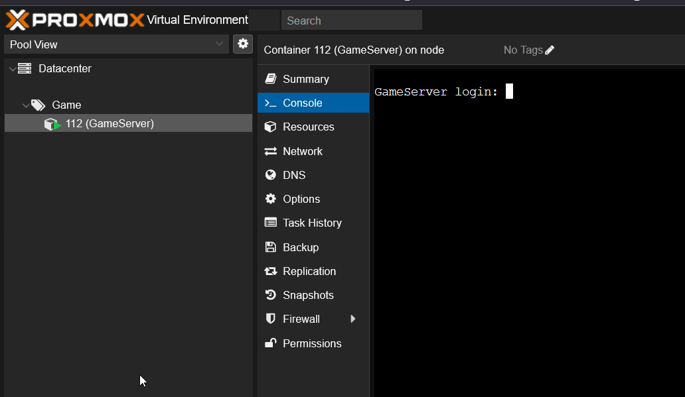

# Game Infrastructure
This repo contains the necessary Terraform and Ansible scripts to setup and deploy different game infrastructure on Proxmox

The included games so far:
- [Assault Cube](https://assault.cubers.net/)

## Future Games
- [Pwn Adventure 3](https://www.pwnadventure.com/)

## Usage
First ensure that you have Terraform and Ansible properly setup. Once installed you need to setup your Terraform variables in `variables.tfvars`. The format of this will look like so:
```
proxmox_domain          = "proxmox.example.com"
proxmox_user            = "terraform"
proxmox_token_name      = "mytoken"
proxmox_token_secret    = "b99fac35-108f-4a1c-8e15-511b51637611"
node_name               = "pxe"
ip_range_cidr           = "192.168.1.1/24"
```

Once this has been configured with the desired settings you can execute the following commands:

```shell
terraform init
terraform plan -var-file="variables.tfvars"
terraform apply -var-file="variables.tfvars"
```

If you did not setup Cloud-Init you maybe able to get the IP of VM or LXC using nmap.

You may also have to manually enable and start SSH.

Once the infrastructure has been deployed you can then head over to the `~/ansible` folder. Here we will need to either hardcode the settings we want or we can use `ansible-vault` to store our variables. The vault should look something like so:

```
server_username: "root"
server_password: "changeme"
```

Once you configured the variables and set the proper IP in the `hosts.ini` you can then begin to execute the following commands:

```shell
# Create a vault if havent already done so
ansible-vault create vault.yml
# To use nano editor: export EDITOR=nano
# Fill out the vault with all the appropriate variables 
ansible-playbook -i hosts.ini Install-AssaultCube-Server.yml --ask-vault-pass
```

You should now have all the files and dependencies installed to run your game server. If properly deployed you should see an LXC container with the hostname you set

